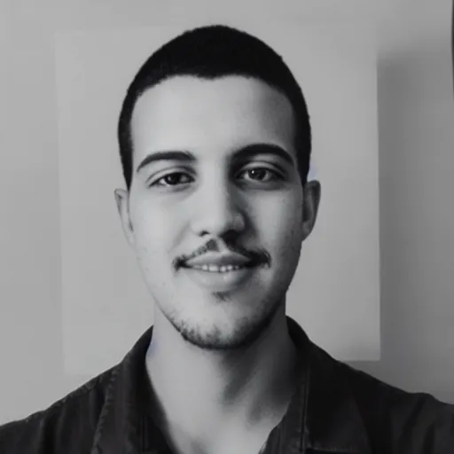
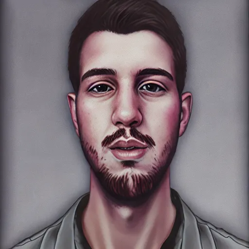
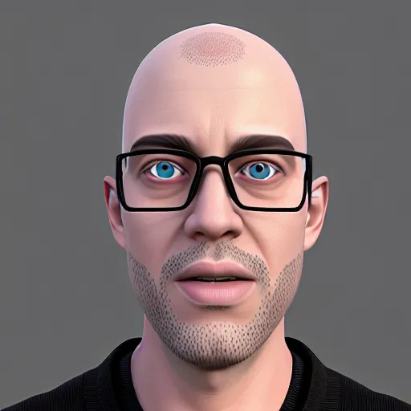
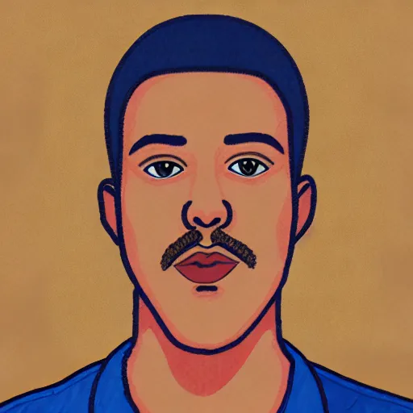
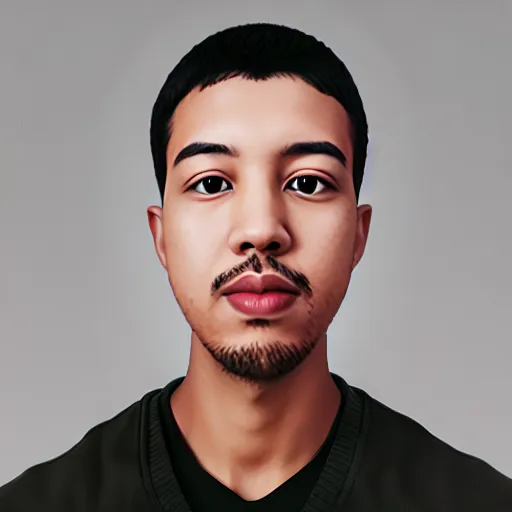
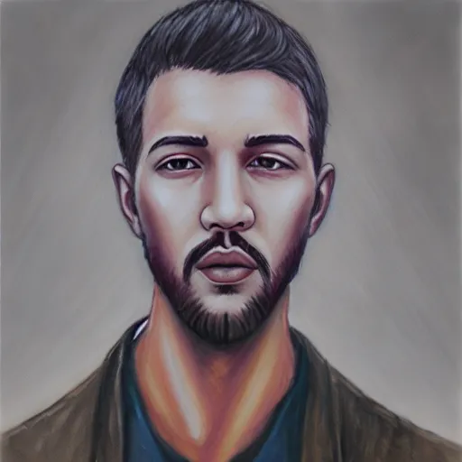
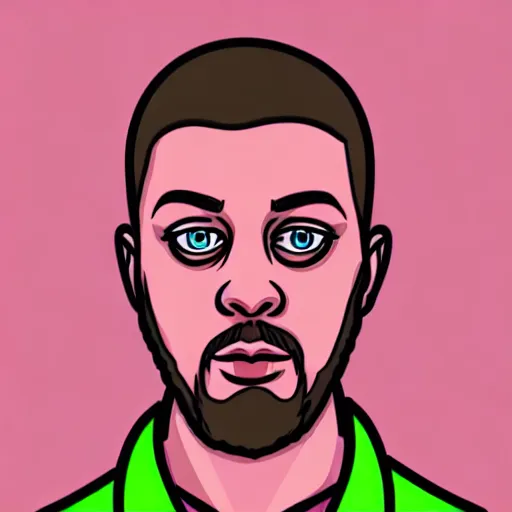
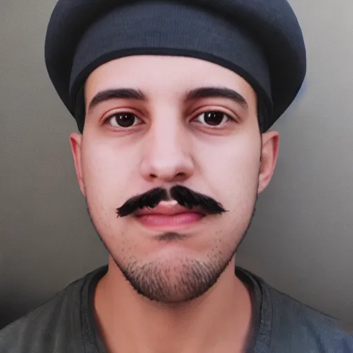
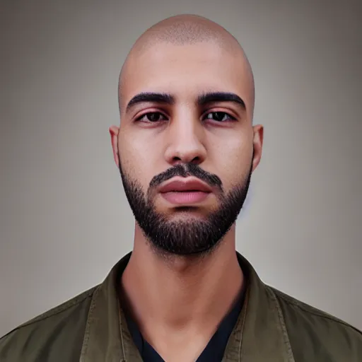

## Stable Diffusion Fine-tuning

This repository provides a practical and end-to-end implementation of **DreamBooth-based fine-tuning** applied to **Stable Diffusion v1.5**.  
The main objective is to personalize a pre-trained text-to-image diffusion model by teaching it a **specific subject or visual concept** from a limited set of images.

Once fine-tuned, the model is able to generate **high-quality and consistent images** of the learned concept using **natural language prompts**, while preserving the general image generation capabilities of Stable Diffusion.

### Project Workflow

1. **Dataset Preparation:** Collection, cleaning, and normalization of custom images.  
2. **Environment Setup:** Python configuration and installation of all dependencies.  
3. **Base Model Testing:** Evaluation of the original Stable Diffusion v1.5 before fine-tuning.  
4. **DreamBooth Training:** Fine-tuning the model on a personalized image dataset.  
5. **Hyperparameter Optimization:** Adjusting training settings to enhance the model's learning and results.
6. **Model Saving & Deployment:** Exporting and publishing the fine-tuned model on HuggingFace.  
7. **Image Generation:** Producing images through detailed textual prompts.  
8. **Pipeline Automation:** Ensuring reproducibility and workflow automation.

### Technologies Used

- PyTorch  
- DreamBooth  
- Stable Diffusion v1.5  
- HuggingFace Diffusers  
- Google Colab (Tesla T4 GPU)

### Results

| # | Prompt Description | Generated Image |
|---|--------------------|-----------------|
| 1 | Avatar with the inscription **"outside"**, black and white photo of KDY person |  |
| 2 | Digital portrait of KDY person, smooth brushwork, subtle lighting, professional expression |  |
| 3 | Illustrated avatar of KDY person, blue eyes, bald, wearing rimless glasses, 3D illustration |  |
| 4 | Photo-style avatar painting of KDY person |  |
| 5 | Chibi character art of KDY person, Asian man, black middle-parted hair, white sweater, shoulders-up view |  |
| 6 | Photorealistic painted avatar of KDY person |  |
| 7 | Illustrated avatar, male passport-style portrait, small chin beard, long hair, mature facial features, light background |  |
| 8 | Illustrated avatar of KDY person, inspired by **Hotline Miami** aesthetics |  |
| 9 | Stylized French avatar of KDY person, wearing a beret and moustache, medium portrait, cartoonish yet refined style |  |
| 10 | Tactical male avatar of KDY person, bald, small black beard with subtle white highlights, military-inspired look, confident expression |  |

### References

- *https://dreambooth.github.io/*
- *https://github.com/huggingface/diffusers*
- *https://huggingface.co/docs/diffusers/training/dreambooth*
- *https://huggingface.co/stable-diffusion-v1-5/stable-diffusion-v1-5*

### *Yassine DARIF* | 2025